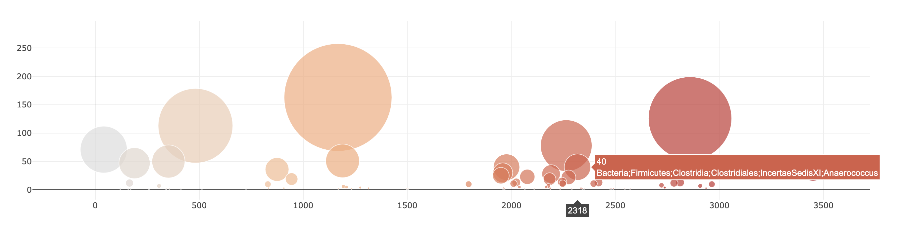

# Belly Button Biodiversity

[Web app deployed through Heroku](https://belly-button-biodiversi.herokuapp.com)

* web page for belly button biodiversity data
 

* dropdown menu for data

* info chart

* pie chart for top ten samples

* guage chart showing washing frequency

* bubble chart for all samples

